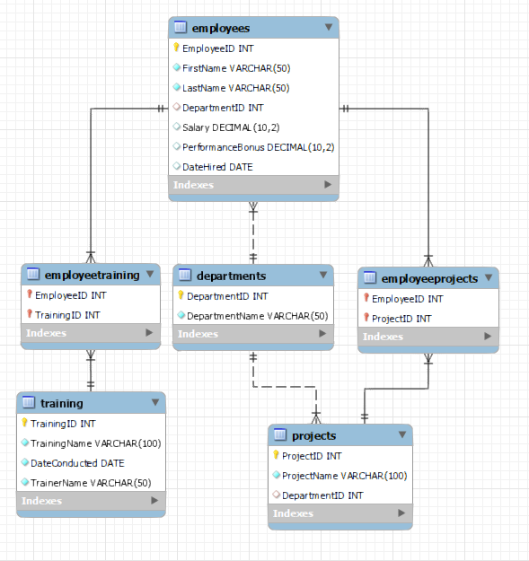

Database Project for HRDatabase
===============================

The scope of this project is to use all the SQL knowledge gained throughout the Manual Testing course and apply them in practice.

**Application under test:** HRDatabase

**Tools used:** MySQL Workbench

**Database description:** The purpose of the HRDatabase is to manage employees, departments, performance bonuses, training sessions, and the trainees who will participate in the training sessions.

1.  **Database Schema**
  

You can find below the database schema that was generated through Reverse Engineer and which contains all the tables and the relationships between them.

The tables are connected in the following way:

*   **Departments** is connected with **Employees** through a **one-to-many** relationship which was implemented through `Departments.DepartmentID` as a primary key and `Employees.DepartmentID` as a foreign key.
*   **Departments** is connected with **Projects** through a **one-to-many** relationship which was implemented through `Departments.DepartmentID` as a primary key and `Projects.DepartmentID` as a foreign key.
*   **Employees** is connected with **Projects** through a **many-to-many** relationship which was implemented with **EmployeeProjects** as a linking (or junction) table as follows: `Employees.EmployeeID` and `Projects.ProjectID` as primary keys, `EmployeeProjects.EmployeeID` and `EmployeeProjects.ProjectID` as foreign keys.
*   **Employees** is connected with **Training** through a **many-to-many** relationship which was implemented with **TrainingEmployees** as a linking (or junction) table as follows: `Employees.EmployeeID` and `Training.TrainingID` as primary keys, `TrainingEmployees.EmployeeID` and `TrainingEmployees.TrainingID` as foreign keys.

  
7.  **Database Queries**
  

1.  **DDL (Data Definition Language)**

The following instructions were written in the scope of **CREATING** the structure of the database (`CREATE` INSTRUCTIONS):

    
    CREATE DATABASE HRDatabase;
    
    CREATE TABLE Departments (
        DepartmentID INT PRIMARY KEY,
        DepartmentName VARCHAR(50) NOT NULL
    );
    
    CREATE TABLE Employees (
        EmployeeID INT PRIMARY KEY,
        FirstName VARCHAR(50) NOT NULL,
        LastName VARCHAR(50) NOT NULL,
        DepartmentID INT,
        Salary DECIMAL(10, 2),
        PerformanceBonus DECIMAL(10, 2),
        FOREIGN KEY (DepartmentID) REFERENCES Departments(DepartmentID)
    );
    
    CREATE TABLE Projects (
        ProjectID INT PRIMARY KEY,
        ProjectName VARCHAR(100) NOT NULL,
        DepartmentID INT,
        FOREIGN KEY (DepartmentID) REFERENCES Departments(DepartmentID)
    );
    
    CREATE TABLE EmployeesProjects (
        EmployeeID INT,
        ProjectID INT,
        PRIMARY KEY (EmployeeID, ProjectID),
        FOREIGN KEY (EmployeeID) REFERENCES Employees(EmployeeID),
        FOREIGN KEY (ProjectID) REFERENCES Projects(ProjectID)
    );
    
    CREATE TABLE Training (
     TrainingID INT PRIMARY KEY,
     TrainingName VARCHAR(100) NOT NULL,
     DateConducted DATE NOT NULL,
     TrainerName VARCHAR(50) NOT NULL 
    );
    
    CREATE TABLE EmployeeTraining (
     EmployeeID INT,
     TrainingID INT,
     PRIMARY KEY (EmployeeID, TrainingID),
     FOREIGN KEY (EmployeeID) REFERENCES Employees(EmployeeID),
     FOREIGN KEY (TrainingID) REFERENCES Training(TrainingID) 
    );
                

After the database and the tables have been created, a few `ALTER` instructions were written in order to update the structure of the database, as described below:

    
    ALTER TABLE Employees ADD DataHired DATE;
    ALTER TABLE EmployeesProjects RENAME TO EmployeeProjects;
    ALTER TABLE Employees CHANGE DataHired DateHired DATE;
    ALTER TABLE Employees DROP COLUMN DateHired;
    ALTER TABLE Employees
    MODIFY COLUMN Salary DECIMAL(12, 2) DEFAULT 50000.00;
                

6.  **DML (Data Manipulation Language)**

In order to be able to use the database I populated the tables with various data necessary in order to perform queries and manipulate the data. In the testing process, this necessary data is identified in the Test Design phase and created in the Test Implementation phase. Below you can find all the insert instructions that were created in the scope of this project:

    
    -- Single Row Insert into Departments
    INSERT INTO Departments (DepartmentID, DepartmentName)
    VALUES (4, 'Marketing');
    
    -- Single Row Insert into Employees
    INSERT INTO Employees (EmployeeID, FirstName, LastName, DepartmentID, Salary, PerformanceBonus, DateHired)
    VALUES (15, 'Laura', 'Smith', 2, 56000, 1100, '2023-08-01');
    
    -- Single Row Insert into Projects
    INSERT INTO Projects (ProjectID, ProjectName, DepartmentID)
    VALUES (3, 'Project C', 1);
    
    -- Single Row Insert into Training
    INSERT INTO Training (TrainingID, TrainingName, DateConducted, TrainerName)
    VALUES (4, 'Communication Skills', '2023-08-15', 'Daniel Popescu');
    
    -- Multiple Rows Insert into Employees
    INSERT INTO Employees (EmployeeID, FirstName, LastName, DepartmentID, Salary, PerformanceBonus, DateHired)
    VALUES
        (16, 'Gabriel', 'Ionescu', 1, 47000, 900, '2024-01-10'),
        (17, 'Monica', 'Radu', 3, 53000, 1200, '2024-02-15');
    
    -- Multiple Rows Insert into Projects
    INSERT INTO Projects (ProjectID, ProjectName, DepartmentID)
    VALUES
        (4, 'Project D', 2),
        (5, 'Project E', 1);
    
    -- Multiple Rows Insert into EmployeeProjects
    INSERT INTO EmployeeProjects (EmployeeID, ProjectID)
    VALUES
        (16, 4),
        (17, 5);
    
    -- Insert with Default Values into Employees
    INSERT INTO Employees (EmployeeID, FirstName, LastName, DepartmentID, Salary)
    VALUES (18, 'Cristina', 'Jianu', 2, DEFAULT);
    -- Assuming Salary has a default value defined in the schema.
    
    -- Insert with NULL Values into Employees
    INSERT INTO Employees (EmployeeID, FirstName, LastName, DepartmentID, Salary, PerformanceBonus, DateHired)
    VALUES (19, 'Lucian', 'Petrescu', 3, NULL, NULL, '2024-04-01');
    
    -- Insert with NULL Values into Projects
    INSERT INTO Projects (ProjectID, ProjectName, DepartmentID)
    VALUES (6, 'Project F', NULL);
                

After the insert, in order to prepare the data to be better suited for the testing process, I updated some data in the following way:

    
    UPDATE Employees SET Salary = 58000 WHERE EmployeeID = 1;
                

11.  **DQL (Data Query Language)**

After the testing process, I deleted the data that was no longer relevant in order to preserve the database clean:

    
    DELETE FROM EmployeeProjects WHERE EmployeeID = 1 AND ProjectID = 1;
                

In order to simulate various scenarios that might happen in real life I created the following queries that would cover multiple potential real-life situations:

    
    SELECT * FROM Employees WHERE DepartmentID = 1;
    
    SELECT * FROM Employees WHERE LastName LIKE 'M%';
    
    SELECT * FROM Employees WHERE Salary > 50000 AND PerformanceBonus > 1000;
    
    SELECT * FROM Employees WHERE DepartmentID = 2 OR DepartmentID = 3;
    
    SELECT AVG(Salary) AS AverageSalary FROM Employees;
    
    SELECT SUM(PerformanceBonus) AS TotalBonus FROM Employees;
    
    SELECT DepartmentID, SUM(Salary) AS TotalSalary FROM Employees GROUP BY DepartmentID HAVING SUM(Salary) > 50000;
    
    SELECT e.FirstName, e.LastName, d.DepartmentName
    FROM Employees e 
    INNER JOIN Departments d ON e.DepartmentID = d.DepartmentID;
    
    SELECT e.FirstName, e.LastName, d.DepartmentName
    FROM Employees e
    LEFT JOIN Departments d ON e.DepartmentID = d.DepartmentID;
    
    SELECT e.FirstName, e.LastName, d.DepartmentName FROM Employees e RIGHT JOIN Departments d ON e.DepartmentID = d.DepartmentID;
    
    SELECT e.FirstName, e.LastName, p.ProjectName FROM Employees e
    CROSS JOIN Projects p;
    
    SELECT * FROM Employees ORDER BY Salary DESC LIMIT 5;
    
    SELECT * FROM Employees
    WHERE Salary > (SELECT AVG(Salary) FROM Employees);
    
    SELECT FirstName, LastName FROM Employees WHERE PerformanceBonus > 1000;
    
    SELECT DepartmentID, COUNT(EmployeeID) AS NumEmployees
    FROM Employees
    GROUP BY DepartmentID;
    
    SELECT DepartmentID, COUNT(EmployeeID) AS NumEmployees FROM Employees
    GROUP BY DepartmentID
    HAVING COUNT(EmployeeID) > 3;
    
    SELECT DepartmentID, AVG(Salary) AS AvgSalary
    FROM Employees
    GROUP BY DepartmentID;
    
    SELECT DepartmentID, AVG(Salary) AS AvgSalary
    FROM Employees
    GROUP BY DepartmentID HAVING AVG(Salary) > 50000;
                

16.  **Conclusions**

This project enhanced my understanding of SQL by applying the concepts learned in the Manual Testing course to create, manage, and manipulate a relational database. I learned how to define complex database structures using DDL commands, efficiently manage data using DML commands, and extract meaningful information using advanced DQL commands. Additionally, I gained practical experience in designing a normalized database schema, implementing relationships between tables, and writing advanced queries to handle real-world scenarios. This comprehensive exercise has significantly improved my database management and SQL query writing skills.
